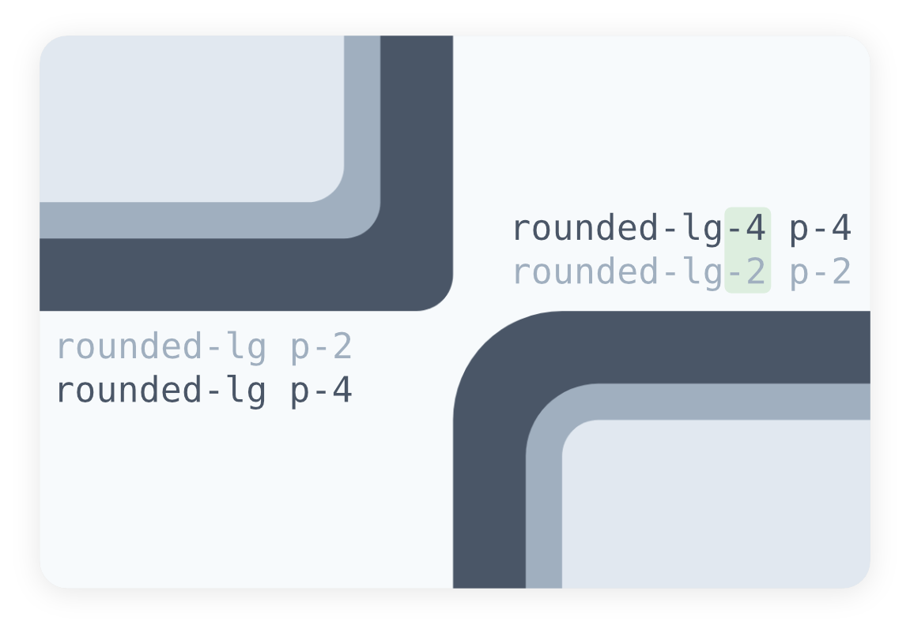

# Tailwind CSS Pulgin for Matching Border Radii

<p align="center">
  
</p>

## Installation

```bash
npm install tailwindcss-padded-radius
```

## Setup

```js
// tailwind.config.js
module.exports = {
  theme: {
    extend: {
      paddedRadius: {
        /* The number of spacings to generate */
        // numberOfSpacings: 64,

        /* The spacing that the other spacings are multiples of */
        // baseSpacing: "0.25rem",

        /* A spacigns object to use in place of numberOfSpacings and baseSpacing */
        // spacings: { '1': '0.25rem', '2': '0.5rem', '3': '0.75rem' }

        /* Whether negative versions should be generated */
        // generateNegative: false,
      },
    },
  },
  plugins: [require("tailwindcss-padded-radius")],
  variants: {
    borderRadius: ["responsive", "paddedRadius"],
  },
};
```

## Usage

For nested border radii to match,
the outer radius must be equal to
the inner radius plus the distance between them.
This plugin adds variants to borderRadius utilties
that let you easily tweak border radii
using the same scale that is used for padding and margin.
So if the inner div has `rounded-md` and `m-2` and the outer div has `p-3`,
the outer radius should be `rounded-md-5`.

```html
<div class="rounded-md-5 p-3  bg-gray-700">
  <div class="rounded-md m-2  w-32 h-32 bg-gray-200"></div>
</div>
```
